# IDENT Framework Integration Plan

> Multi-phase plan to integrate additional PDE identification methods into PDE-Selector.

---

## Candidate Frameworks

| Framework | Availability | Strength | Integration Effort |
|-----------|--------------|----------|-------------------|
| **PySINDy** | pip install pysindy | Well-maintained, PDE-FIND built-in | Small |
| **WSINDy** | Via PySINDy | Weak form, robust to noise | Small |
| **RobustIDENT (RLAD-SID)** | Literature only | Outlier-robust (L1 loss) | Large |
| **DeepMoD** | pip install deepmod | Neural network + symbolic | Medium |
| **Neural SINDy** | Research code | Deep learning features | Large |

---

## Recommended Priority

**Phase 1**: PySINDy + WSINDy (fastest, pip-installable, covers weak form)
**Phase 2**: RobustIDENT (implement from literature if needed)
**Phase 3**: Neural methods (DeepMoD) — optional, for research comparison

---

## Phase 1: PySINDy Integration

**Objective**: Integrate PySINDy as the second IDENT method.

### Why PySINDy?
- pip-installable (`pip install pysindy`)
- Mature library (v1.7+) with PDE support
- Built-in PDE-FIND algorithm
- Supports weak form via `WeakPDELibrary`
- Compatible with our adapter interface

### Files to Create/Modify

#### [NEW] src/ident_methods/pysindy_method.py
```python
class PySINDyMethod(IdentMethodBase):
    @property
    def name(self) -> str:
        return "PySINDy"
    
    def run(self, u_win, dx, dt, **kwargs):
        # Construct SINDy model with PDELibrary
        # Fit to data
        # Extract metrics and identified terms
        return metrics, info
```

#### [NEW] src/ident_methods/wsindy_method.py
```python
class WSINDyMethod(IdentMethodBase):
    """Weak-form SINDy via PySINDy's WeakPDELibrary."""
    @property
    def name(self) -> str:
        return "WSINDy"
```

#### [MODIFY] pyproject.toml
Add `pysindy>=1.7` to dependencies.

#### [MODIFY] config/default.yaml
```yaml
methods:
  - WeakIDENT
  - PySINDy    # NEW
  - WSINDy     # NEW
```

### Acceptance Criteria
- `pytest tests/test_pysindy.py -v` passes
- Can run benchmark with `methods: [WeakIDENT, PySINDy]`
- Metrics computed correctly (F1, coeff_err, residual)

### Effort
**Small** — PySINDy has clean API, mostly adapter code.

---

## Phase 2: RobustIDENT Implementation

**Objective**: Implement RobustIDENT (RLAD-SID) from literature for outlier robustness.

### Why RobustIDENT?
- Uses L1 loss (robust to outliers)
- Complements WeakIDENT and PySINDy (L2-based)
- Addresses high-noise regime

### Approach Options

**Option A: Implement from Paper**
- Implement RLAD-SID based on published algorithm
- Uses ADMM optimization
- Requires building feature library + L1 regression

**Option B: Use CVXPY for L1 Regression**
- Leverage existing optimization libraries
- Build feature library manually
- Simpler but less optimized

### Files to Create

#### [NEW] src/ident_methods/robustident_method.py
```python
class RobustIdentMethod(IdentMethodBase):
    """RLAD-SID: L1-regularized sparse regression."""
    
    def run(self, u_win, dx, dt, **kwargs):
        # Build feature library
        # Solve L1-regularized regression via ADMM or CVXPY
        # Extract metrics
        return metrics, info
```

#### [NEW] src/ident_methods/l1_solver.py
ADMM-based L1 solver or CVXPY wrapper.

### Acceptance Criteria
- RobustIDENT performs better than WeakIDENT on high-outlier data
- Test: `test_robustident_outliers.py`

### Effort
**Large** — Requires algorithm implementation and validation.

---

## Phase 3: Neural Methods (Optional)

**Objective**: Add deep learning-based methods for comparison.

### Candidates
- **DeepMoD**: Neural network + symbolic regression
- **PDE-Net**: CNN for coefficient learning
- **Neural SINDy**: Autoencoder + SINDy

### Implementation
Defer until Phases 1-2 complete. Evaluate need based on research goals.

### Effort
**Large** — Requires PyTorch/TensorFlow integration.

---

## Implementation Timeline

```mermaid
gantt
    title IDENT Integration Phases
    dateFormat X
    axisFormat %s

    section Phase 1
    PySINDy adapter       :p1a, 0, 2
    WSINDy adapter        :p1b, 0, 2
    Tests + config        :p1c, 2, 3
    Benchmark comparison  :p1d, 3, 4

    section Phase 2
    L1 solver             :p2a, 4, 6
    RobustIDENT adapter   :p2b, 5, 7
    Outlier tests         :p2c, 7, 8

    section Phase 3
    DeepMoD research      :p3a, 8, 10
```



---

## Phase 1 Detailed Checklist

### Step 1.1: Create PySINDy Adapter
- [ ] Add `pysindy>=1.7` to pyproject.toml
- [ ] Create `src/ident_methods/pysindy_method.py`
- [ ] Implement `PySINDyMethod.run()`:
  - Build feature library (polynomials, derivatives)
  - Fit SINDy model
  - Extract coefficients
  - Compute F1, coefficient error, residual
- [ ] Register method in `METHOD_REGISTRY`

### Step 1.2: Create WSINDy Adapter
- [ ] Create `src/ident_methods/wsindy_method.py`
- [ ] Use PySINDy's `WeakPDELibrary` for weak formulation
- [ ] Register method

### Step 1.3: Add Tests
- [ ] Create `tests/test_pysindy.py`
- [ ] Test on Burgers equation (known PDE)
- [ ] Verify metrics match expected ranges

### Step 1.4: Update Config and Benchmarks
- [ ] Add PySINDy/WSINDy to `config/default.yaml`
- [ ] Run comparative benchmark
- [ ] Document results

---

## Risk Assessment

| Risk | Impact | Mitigation |
|------|--------|------------|
| PySINDy API changes | Medium | Pin version, add version checks |
| Metric incompatibility | High | Normalize metrics across methods |
| Performance bottleneck | Medium | Cache feature libraries |
| Missing ground truth for F1 | High | Use synthetic data for validation |

---

## Decision Gate

Before Phase 2, evaluate:
1. Does PySINDy/WSINDy provide sufficient method diversity?
2. Are there real use cases requiring outlier robustness?
3. What is the research publication scope?

If single-paper scope, Phase 1 may be sufficient.

---

*Created: December 2025*
