# WeakIdent-Python: Implementation Roadmap

> Engineering plan to make this repository reusable, experimentally credible, and paper-ready.  
> **Scope**: Code and infrastructure only — no manuscript text.

---

## Executive Summary

This plan addresses the gaps documented in [project_journey.md](file:///Users/pranavlende/Documents/School/College%20Senior/MATH%20Research/weakident/WeakIdent/WeakIdent-Python/docs/project_journey.md):

| Gap | Milestone | Effort |
|-----|-----------|--------|
| RobustIDENT stubbed | M1 | Medium |
| Slow dataset generation | M1 | Medium |
| No full pipeline validation | M2 | Medium |
| No benchmarks | M2 | Large |
| Missing CI/CD | M0 | Small |
| Not pip-installable | M0 | Small |
| No examples | M1 | Small |
| No integration test | M2 | Small |

---

## M0: Scaffolding & CI Foundation

**Objective**: Make repo pip-installable, add CI, and create directory structure for experiments/examples.

### Files to Create

#### [NEW] pyproject.toml
```toml
[build-system]
requires = ["setuptools>=61.0"]
build-backend = "setuptools.build_meta"

[project]
name = "weakident-selector"
version = "0.1.0"
description = "PDE-Selector meta-learner for WeakIDENT"
requires-python = ">=3.9"
dependencies = [
    "numpy>=1.22",
    "scipy>=1.9",
    "pandas>=1.5",
    "scikit-learn>=1.3",
    "matplotlib>=3.5",
    "PyYAML>=6.0",
    "joblib>=1.3",
    "tqdm>=4.65",
    "catboost>=1.2",
    "numpy-indexed>=0.3.7",
]
```

#### [NEW] .github/workflows/ci.yml
Basic pytest workflow on push/PR to `main`.

#### [NEW] experiments/README.md
Describes structure for dated experiment runs with provenance.

#### [NEW] examples/README.md
Describes quickstart examples and Jupyter notebooks.

#### [NEW] docs/README.md
Links to `project_journey.md` and `implementation_plan.md`.

### Acceptance Criteria
- `pip install -e .` succeeds
- `pytest tests/ -v` runs in GitHub Actions
- CI badge shows green on main branch

### Risks & Mitigations
| Risk | Mitigation |
|------|------------|
| numpy version conflicts | Test with Python 3.9, 3.10, 3.11 matrices |
| catboost install slow | Add optional dependency group for catboost |

**Effort**: Small

---

## M1: Scalable Dataset Generation & IDENT Extensibility

**Objective**: Make `label_dataset.py` production-ready with parallelization and checkpointing; define clear adapter contract for additional IDENT methods.

### Files to Modify

#### [MODIFY] src/label_dataset.py
- Add `--parallel N` flag using `joblib.Parallel`
- Add checkpointing: save intermediate results to `.npz` every K windows
- Add `--resume` flag to continue from checkpoint
- Use `tqdm` with proper multiprocessing support

#### [MODIFY] src/ident_api.py
- Document "Integration Contract" for new IDENT methods
- Add `METHOD_REGISTRY` dict for dynamic method registration
- Provide `@register_ident_method` decorator pattern

#### [NEW] src/ident_methods/__init__.py
- Package for pluggable IDENT implementations
- Include `base.py` with abstract `IdentMethodBase` class

#### [NEW] src/ident_methods/base.py
```python
class IdentMethodBase(ABC):
    """Integration contract for IDENT methods."""
    
    @abstractmethod
    def run(self, u_win, dx, dt, **kwargs) -> tuple[np.ndarray, dict]:
        """
        Args:
            u_win: (nt, nx) spatiotemporal window
            dx, dt: grid spacings
            **kwargs: method-specific parameters
        
        Returns:
            metrics: np.ndarray of shape (3,) — [f1, coeff_err, residual]
            info: dict — {terms: list[str], coefficients: dict, runtime: float}
        """
        ...
    
    @property
    @abstractmethod
    def name(self) -> str: ...
```

#### [NEW] docs/IDENT_INTEGRATION.md
Contract documentation: I/O shapes, metrics returned, how to add new methods.

### Acceptance Criteria
- `python scripts/make_dataset.py --cfg config/default.yaml --parallel 4` runs 2-4x faster
- Checkpoint file created at `artifacts/.checkpoint.npz`
- After crash, `--resume` continues from last checkpoint
- New test: `tests/test_checkpoint.py` validates resume behavior

### Verification Commands
```bash
# Time sequential vs parallel
time python scripts/make_dataset.py --cfg config/default.yaml --output /tmp/seq
time python scripts/make_dataset.py --cfg config/default.yaml --output /tmp/par --parallel 4

# Test checkpoint/resume
python scripts/make_dataset.py --cfg config/default.yaml --parallel 4 &
sleep 30 && kill $!
python scripts/make_dataset.py --cfg config/default.yaml --parallel 4 --resume
```

### Risks & Mitigations
| Risk | Mitigation |
|------|------------|
| joblib pickling errors with weak_ident_pred | Use `loky` backend; wrap in pure-Python function |
| Race conditions in checkpoint writes | Use atomic file rename pattern |

**Effort**: Medium

---

## M2: Full Pipeline Validation & Benchmarks

**Objective**: Run and validate the selector on a held-out test set; compute regret, top-1 accuracy, compute saved.

### Files to Modify

#### [MODIFY] scripts/evaluate_selector.py
- Add `--output-json` flag for machine-readable metrics
- Add `--plot` flag to generate evaluation figures
- Compute and report: regret, top-1 accuracy, compute saved %

#### [MODIFY] src/eval.py
- Add `compute_regret()` function
- Add `compute_top1_accuracy()` function
- Add `compute_compute_saved()` function (compares selector-chosen method time vs oracle)

#### [NEW] scripts/run_benchmark.py
- Single script to run full benchmark suite
- Generates `artifacts/benchmark_results.json` and figures

#### [NEW] experiments/baseline_benchmark/
- `config.yaml`: benchmark configuration
- `README.md`: how to reproduce
- `.gitkeep`

### Files to Create

#### [NEW] tests/test_integration.py
End-to-end integration test:
1. Generate mini dataset (2 PDEs, 2 noise levels, ~20 windows)
2. Train selector
3. Evaluate on holdout
4. Assert regret < 0.5, top-1 > 60%

### Acceptance Criteria
- `python scripts/run_benchmark.py` completes and produces:
  - `artifacts/benchmark_results.json`
  - `artifacts/figures/regret_histogram.png`
  - `artifacts/figures/top1_by_noise.png`
- Integration test passes: `pytest tests/test_integration.py -v`

### Verification Commands
```bash
# Full benchmark (may take 1+ hours)
python scripts/run_benchmark.py --cfg experiments/baseline_benchmark/config.yaml

# Quick integration test (~2 minutes)
pytest tests/test_integration.py -v --timeout=180
```

### Risks & Mitigations
| Risk | Mitigation |
|------|------------|
| WeakIDENT failures on edge cases | Add try/except with fallback metrics in benchmark |
| Benchmark takes too long | Add `--quick` flag with reduced parameter sweep |

**Effort**: Large

---

## M3: Examples & Documentation Polish

**Objective**: Add usage examples and improve documentation.

### Files to Create

#### [NEW] examples/quickstart.py
Simple example: load pre-trained model, select method for new data.

#### [NEW] examples/train_from_scratch.py
Full example: generate data → train → evaluate → save model.

#### [NEW] examples/notebooks/demo.ipynb
Interactive Jupyter notebook demonstrating the workflow.

### Files to Modify

#### [MODIFY] README.md
- Add installation section (pip install)
- Add quickstart code snippet
- Add link to examples/

### Acceptance Criteria
- `python examples/quickstart.py` runs without error
- `python examples/train_from_scratch.py` runs without error (with small config)
- Notebook executes end-to-end

**Effort**: Small

---

## M4: Research Artifact Provenance

**Objective**: Create scripts to reproduce all paper figures and ensure experiment reproducibility.

### Files to Create

#### [NEW] scripts/generate_figures.py
- Reads `artifacts/benchmark_results.json`
- Generates all paper figures to `artifacts/figures/`
- Logs git hash and timestamp

#### [NEW] experiments/README.md
Template for experiment folders:
```
experiments/<name>/
├── config.yaml      # Experiment config
├── git_info.txt     # git log -1; git diff HEAD
├── environment.txt  # pip freeze
├── outputs/         # Results
└── README.md        # What this experiment tests
```

#### [MODIFY] scripts/run_benchmark.py
- Automatically create `git_info.txt` and `environment.txt` in output folder

### Acceptance Criteria
- `scripts/generate_figures.py` produces identical figures from same `benchmark_results.json`
- Experiment folder contains full provenance (git hash, pip freeze, config)

**Effort**: Medium

---

## Decision Gate: RobustIDENT Implementation

> RobustIDENT is mentioned in the spec but stubbed. This section outlines options for proceeding.

### Option A: Implement RobustIDENT from Literature
**Pros**: Full multi-method evaluation; stronger paper contribution  
**Cons**: Significant effort (1-2 weeks); may need separate research
**Evidence needed**: Literature search for RobustIDENT algorithm; check if code is available

### Option B: Use WSINDy as Second Method
**Pros**: Published Python implementation (pysindy); well-documented  
**Cons**: Different algorithm family; may not be fair comparison
**Evidence needed**: Test pysindy integration; verify it produces comparable metrics

### Option C: Defer Second Method; Focus on Extensibility
**Pros**: Ship faster; infrastructure ready for future methods  
**Cons**: Paper limited to single-method validation
**Evidence needed**: Advisor approval for single-method scope

### Recommendation
Start with **Option C** for M0-M2, then evaluate **Option B** (WSINDy via pysindy) as the second method. WSINDy is well-maintained and pip-installable.

---

## Priority Order

```mermaid
gantt
    title Implementation Milestones
    dateFormat  X
    axisFormat %s

    section M0 - Scaffolding
    pyproject.toml           :m0a, 0, 1
    CI workflow              :m0b, 0, 1
    Directory structure      :m0c, 0, 1

    section M1 - Dataset Scaling
    Parallel labeling        :m1a, 1, 3
    Checkpointing            :m1b, 1, 3
    IDENT adapter contract   :m1c, 1, 3

    section M2 - Validation
    Benchmark script         :m2a, 3, 5
    Evaluation metrics       :m2b, 3, 5
    Integration test         :m2c, 3, 5

    section M3 - Examples
    Quickstart examples      :m3a, 5, 6
    Jupyter notebook         :m3b, 5, 6

    section M4 - Provenance
    Figure generation        :m4a, 6, 7
    Experiment templates     :m4b, 6, 7
```



---

## Summary Table

| Milestone | Objective | Key Deliverables | Effort |
|-----------|-----------|------------------|--------|
| M0 | Scaffolding & CI | pyproject.toml, GitHub Actions, directory structure | Small |
| M1 | Scalable Dataset | Parallel + checkpoint in label_dataset.py, IDENT contract | Medium |
| M2 | Validation & Benchmarks | run_benchmark.py, evaluation metrics, integration test | Large |
| M3 | Examples & Docs | quickstart.py, train_from_scratch.py, Jupyter notebook | Small |
| M4 | Provenance | generate_figures.py, experiment templates | Medium |

---

*Created: December 2025*  
*Related: [project_journey.md](file:///Users/pranavlende/Documents/School/College%20Senior/MATH%20Research/weakident/WeakIdent/WeakIdent-Python/docs/project_journey.md)*
